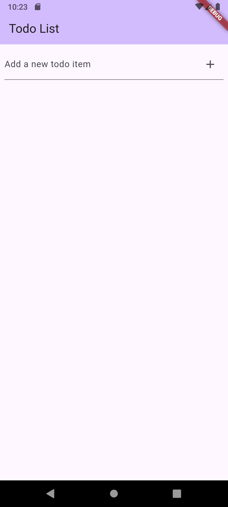
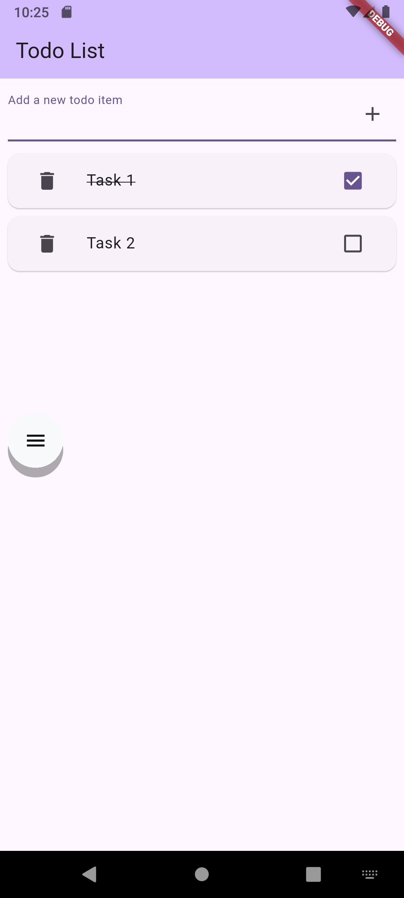
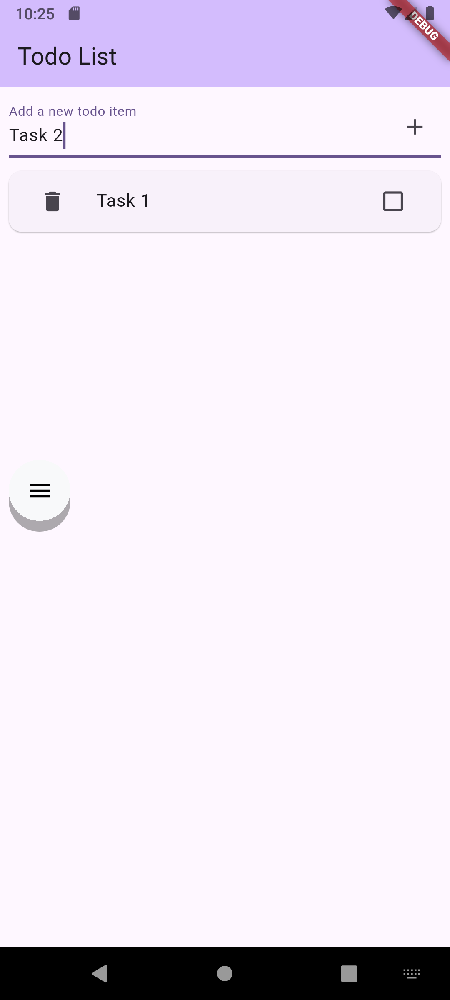

# Todo List Application

This is a simple Todo List application built with Flutter. It allows users to add, mark as complete, and delete todo items.

## Features

- **Add Todo Items**: Easily add new tasks to your list using the input field.
- **Mark as Complete**: Toggle the completion status of a todo item by tapping the checkbox.
- **Delete Todo Items**: Remove tasks from your list using the delete icon.
- **No Persistence**: This version of the application does not persist data. All todo items are stored in memory and will be lost when the application is closed.

## How to Use

1.  **Add a Task**: Type your task in the text field at the top and press Enter or tap the '+' icon.
2.  **Mark as Complete/Incomplete**: Tap the checkbox next to a task to mark it as complete or incomplete.
3.  **Delete a Task**: Tap the trash can icon next to a task to remove it from the list.

## Screenshots

Here are some screenshots of the application in action:

### Main Screen

### Task Marked as Complete

### Adding a New Task

## Getting Started

To run this project locally, ensure you have Flutter installed. Then:

1.  Clone this repository:
    `git clone [repository_url]`
2.  Navigate to the project directory:
    `cd todo_list`
3.  Get Flutter dependencies:
    `flutter pub get`
4.  Run the application:
    `flutter run`

For more information on Flutter development, refer to the official [Flutter documentation](https://docs.flutter.dev/).
